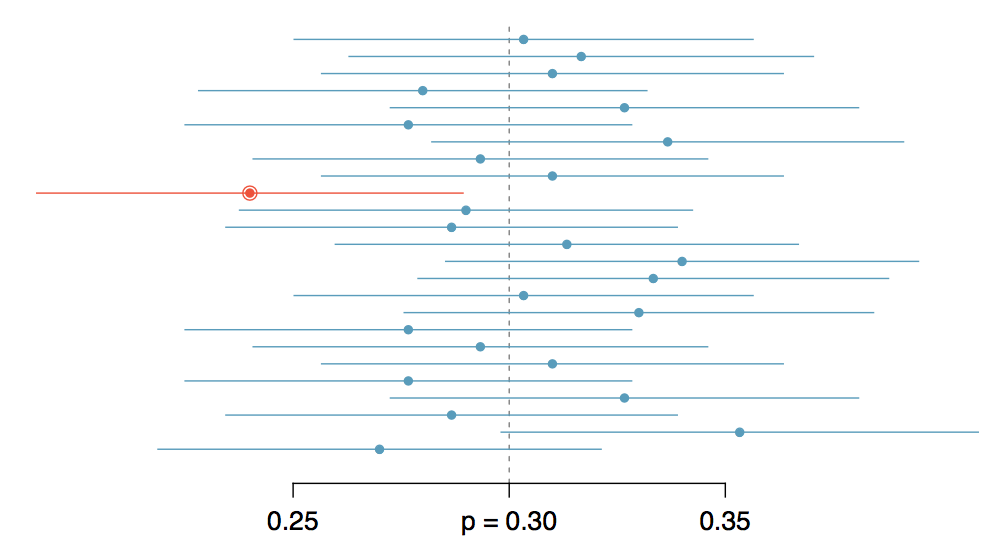

```{r setup, include=FALSE}
library(knitr)
options(digits=2)
knitr::opts_chunk$set(echo = TRUE)
library(dplyr)
library(ggplot2)
```


## {.flexbox .vcenter .build}

**Confidence Interval**: a plausible range of values for a population parameter.


##
<center>

</center>


##
<center>

</center>


## Construction of a CI {.build}

$$ \textrm{point estimate} \pm \textrm{margin of error} $$

If the distribution of the point estimate can be well approximated by the Normal:

$$ \textrm{point estimate} \pm 1.96 \times SE $$

- *point estimate*: $\hat{p}$, $\bar{x}$
- *standard error (SE)*: standard deviation of the sampling distribution.


## Question

"The proportion of Americans who want to maintain planned parenthood is estimated
to be between 39.8% and 58.2% with 95% confidence." Which of the following interpretations
are reasonable?

1. The interval [.398, .582] provides a plausible range for $\hat{p}$
2. We are certain that the population proportion lies within this interval.
3. If we took many more samples of the same size and computed many $\hat{p}$s and
many CIs, around 95% of those CIs would contain the population proportion.


## {.flexbox .vcenter}

<center>

</center>