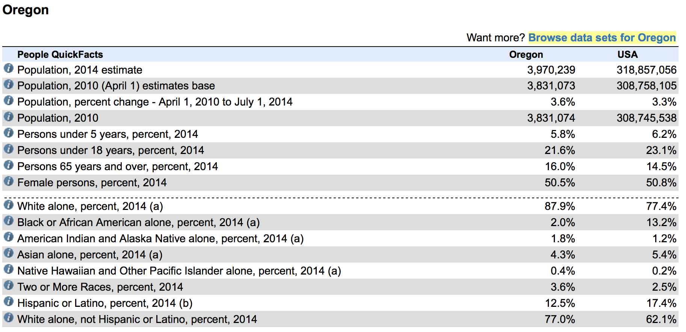
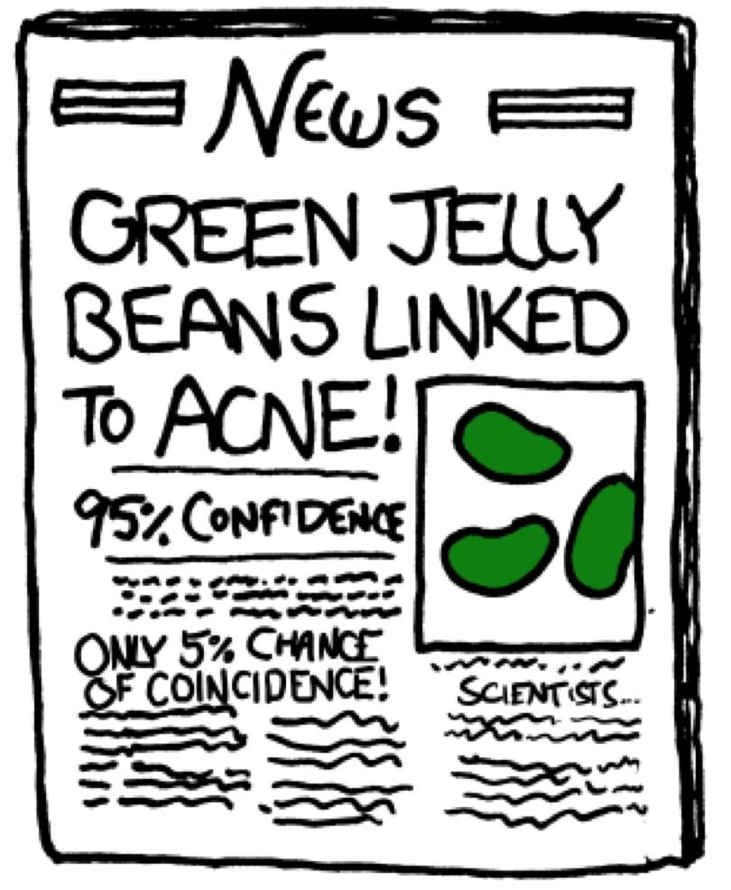

```{r setup, include=FALSE}
library(knitr)
options(digits=3)
knitr::opts_chunk$set(echo = TRUE)
library(dplyr)
library(ggplot2)
library(oilabs)
```


# Introducing $\chi^2$

## Ex: Diversity at Reed {.build}

<center>

</center>

- In terms of ethnic diversity, how does the first year student body compare
to the general population of Oregon?

## 
<center>

</center>


##
<center>

</center>


## The data {.build}

Ethnicity | Asian | Black | Hispanic | White | Other | Total
----------|-------|-------|----------|-------|-------|-------
Reed count|  49   |   10  |   34     |  206  |  55   |  354
Oregon %  |  .043 |  .02  |   .125   |  .77  | .042  |   1

<br/>

If the students at Reed were drawn from a population with these proportions,
how many *counts* would we expect in each group?

$$\textrm{exp. count} = n \times p_i$$


## The data {.build}

Ethnicity   | Asian | Black | Hispanic | White | Other | Total
------------|-------|-------|----------|-------|-------|-------
Obs. count  |  49   |   10  |   34     |  206  |  55   |  354
Exp. count | 15.22 |  7.08 | 44.25 | 272.58 | 14.87 | 354

<br/>

- Some sampling variability is expected, but how far from expected is too far?


## Simulating Oregonian Reedies {.build}

```{r sim}
n <- 354
p <- c(.043, .02, .125, .77, .042)
samp <- factor(sample(c("asian", "black", "hispanic", "white", "other"), 
       size = n, replace = TRUE, prob = p), 
       levels = c("asian", "black", "hispanic", "white", "other"))
table(samp)
obs <- c(49, 10, 34, 206, 55)
```


## Simulating Oregonian Reedies {.build}


```{r sim2}
obs <- c(49, 10, 34, 206, 55)
samp <- factor(sample(c("asian", "black", "hispanic", "white", "other"), 
       size = n, replace = TRUE, prob = p), 
       levels = c("asian", "black", "hispanic", "white", "other"))
table(samp)
samp <- factor(sample(c("asian", "black", "hispanic", "white", "other"), 
       size = n, replace = TRUE, prob = p), 
       levels = c("asian", "black", "hispanic", "white", "other"))
table(samp)
```


## Simulating Oregonian Reedies {.build}

```{r echo = FALSE}
library(infer)
reed_demos <- data.frame(ethnicity = rep(c("asian", "black", "hispanic", "white", "other"), times = c(49, 10, 34, 206, 55)))
```


```{r eval = FALSE}
reed_demos %>%
  specify(response = ethnicity) %>%
  hypothesize(null = "point", p = c("asian"    = .043, 
                                    "black"    = .02, 
                                    "hispanic" = .125, 
                                    "white"    = .77, 
                                    "other"    = .042)) %>%
  generate(reps = 500, type = "simulate")
```

## Inference on many ps {.build}

We *could* do a tests/CIs on $p_{reed} - p_{oregon}$ for each group, however:

- We have the whole population of Oregon.
- Beware of multiple comparisons!

<center>

</center>

##
<center>

</center>

## Creating a statistic {.build}

For each of $k$ categories:

1. Calculate the difference between observed and expected counts.
2. Scale each difference by an estimate of the SE ($\sqrt(exp)$).
3. Square the scaled difference to get rid of negatives.


Then add them all up.

$$\chi^2 = \sum_{i = 1}^k \frac{(obs - exp)^2}{exp}$$


##
Ethnicity   | Asian | Black | Hispanic | White | Other | Total
------------|-------|-------|----------|-------|-------|-------
Obs. count  |  49   |   10  |   34     |  206  |  55   |  354
Exp. count | 15.22 |  7.08 | 44.25 | 272.58 | 14.87 | 354

$$
Z_{asian}^2 = (49 - 15.22)^2/15.22 = 74.97 \\
Z_{black}^2 = (10 - 7.08)^2/7.08 = 1.20 \\
Z_{hispanic}^2 = (34 - 51.5)^2/51.5 = 5.95 \\
Z_{white}^2 = (206 - 272.58)^2/272.58 = 16.26 \\
Z_{other}^2 = (55 - 14.87)^2/14.87 = 108.30
$$

$$
Z_{asian}^2 + Z_{black}^2 + Z_{hispanic}^2 + Z_{white}^2 + Z_{other}^2 = 206.68 = \chi^2_{obs}
$$


## Simulating $\chi^2$ under $H_0$

```{r sim3, echo = FALSE}
n <- 354
p <- c(.043, .02, .125, .042, .77)
chisqs <- rep(0, 1000)
set.seed(405)

for(i in 1:1000) {
  samp <- factor(sample(c("asian", "black", "hispanic", "white", "other"), 
       size = n, replace = TRUE, prob = p), 
       levels = c("asian", "black", "hispanic", "white", "other"))
  obs <- c(table(samp))
  chisqs[i] <- chisq.test(obs, correct = FALSE, p = p)$statistic
}
```

```{r eval = FALSE}
null_dist <- reed_demos %>%
  specify(response = ethnicity) %>%
  hypothesize(null = "point", p = c("asian"    = .043, 
                                    "black"    = .02, 
                                    "hispanic" = .125, 
                                    "white"    = .77, 
                                    "other"    = .042)) %>%
  generate(reps = 500, type = "simulate") %>%
  calculate(stat = "Chisq")
```


## The null distribution {.build}

```{r, echo=FALSE, fig.height=3}
library(ggplot2)
qplot(chisqs, geom = "density")
```

What is the probability of observing our data or more extreme ($\chi^2 = 206.68$) under
the null hypothesis that Reedies share the same ethnicity proportions as Oregon?

About zero.


## An alternate path to the null {.build}

If...

1. Indepedent observations
2. Each cell count has a count $\ge$ 5
3. $k \ge 3$

then our statistic can be well-approximated by the $\chi^2$ distribution with 
$k - 1$ degrees of freedom.


## The null distribution {.build}

```{r, echo = FALSE, fig.height=3}
qplot(chisqs, geom = "density") +
  stat_function(fun = dchisq, args = c(df = 4), col = "tomato")
```

```{r}
1 - pchisq(206.68, df = 4)
```

