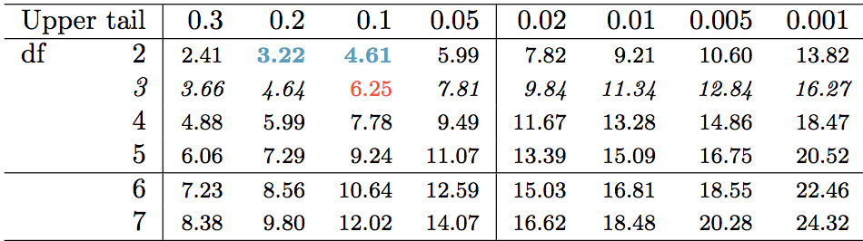
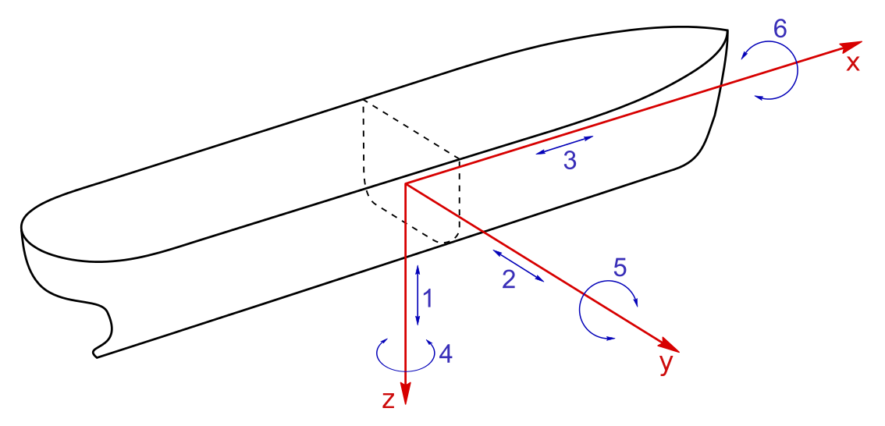
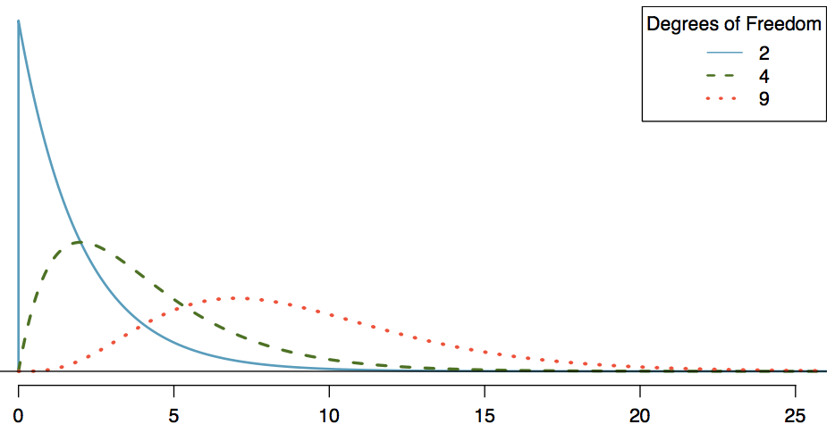

```{r setup, include=FALSE}
library(knitr)
options(digits=3)
knitr::opts_chunk$set(echo = TRUE)
library(dplyr)
library(ggplot2)
library(oilabs)
```


# $\chi^2$ Goodness of Fit


## {.build}
Ethnicity   | Asian | Black | Hispanic | White | Other | Total
------------|-------|-------|----------|-------|-------|-------
Obs. count  |  49   |   10  |   34     |  206  |  55   |  354
Exp. count | 15.22 |  7.08 | 44.25 | 272.58 | 14.87 | 354

$$
Z_{asian}^2 = (49 - 15.2)^2/15.2 = 75.16 \\
Z_{black}^2 = (10 - 7.08)^2/7.08 = 1.20 \\
Z_{hispanic}^2 = (34 - 44.25)^2/44.25 = 2.37 \\
Z_{white}^2 = (206 - 272.58)^2/272.58 = 16.26 \\
Z_{other}^2 = (55 - 14.87)^2/14.87 = 108.3
$$

$$
Z_{asian}^2 + Z_{black}^2 + Z_{hispanic}^2 + Z_{white}^2 + Z_{other}^2 = 203.29 = \chi^2_{obs}
$$


## Question {.build}

Which of the following is an appropriate null hypothesis?

1. Ethnic diversity and choice of college are independent of one another.
2. Ethnic diversity and home-state are independent of one another.
3. $p_{asian} = p_{black} = p_{hispanic} = p_{white} = p_{other}$.
4. The first-year class at Reed is sampled from a population that shares
the same ethnic distribution as Oregon.


## Goodness of Fit Test {.build .smaller}

**$H_0$**: The first-year class at Reed is sampled from a population that shares
*the same* ethnic distribution as Oregon.

$$
p_{asian} = .043, \quad p_{black} = .02, \quad p_{hispanic} = .125, \quad p_{white} = .77, \quad p_{other} = .042
$$

**$H_A$**: The first-year class at Reed is sampled from a population that has a 
*different* ethnic distribution than Oregon.

At least one $p$ is different.


## Constructing the Null Distribution {.build}

1. **Simulation**: simulate many first-year Oregonian Reedie classes and 
calculate the $\chi^2$ for each.
2. **Probability Theory**: multinomial distribution. $X \sim \textrm{multinom}(n, p_1, p_2, p_3, p_4, p_5)$.
3. **Chi-Squared Approximation**: if conditions are reasonable, the $\chi^2$ will
follow a known distribution under the null hypothesis.

```{r sim3, echo = FALSE}
n <- 412
p <- c(.043, .02, .125, .042, .77)
chisqs <- rep(0, 1000)
set.seed(405)

for(i in 1:1000) {
  samp <- sample(c("asian", "black", "hispanic", "other", "white"), 
       size = n, replace = TRUE, prob = p)
  obs <- c(table(samp))
  chisqs[i] <- chisq.test(obs, correct = FALSE, p = p)$statistic
}
```

```{r, echo=FALSE, fig.height=3}
library(ggplot2)
qplot(chisqs, geom = "density") +
  stat_function(fun = dchisq, args = c(df = 4), col = "tomato")
```


## Conditions for the $\chi^2$ approximation {.build}

1. Independent observations
2. Each expected cell count is $\ge$ 5
3. $k \ge 3$

then our statistic can be well-approximated by the $\chi^2$ distribution with 
$k - 1$ degrees of freedom.


## Finding a p-value {.build}

### Table
<center>

</center>

### R
```{r}
1 - pchisq(203.29, df = 4)
```

We reject the hypothesis that the Reed first-year class represents a random sample
from Oregon w.r.t ethnicity.


## Degrees of Freedom

*The number of independent ways by which a dynamic system can move, without violating any constraint imposed on it.* (wikipedia)

<center>

</center>


## Degrees of Freedom {.build}
*The number of parameters that are free to vary, without violating any constraint imposed on it*.

### Parameters
$$ p_{asian}, p_{black}, p_{hispanic}, p_{white}, p_{other} $$

Since $\sum_{i = 1}^k p_i = 1$, one of our parameters is contrained, leaving $k-1$ 
that are free to vary.


## Shape of the $\chi^2$

<br/>

<center>

</center>

<br/>


## Confidence Intervals for $\chi^2$ {.build}

These make no sense. Why not?

- We don't really care what the *true* $\chi^2$ parameter value is.
- A two-sided interval wouldn't make sense
    - Distribution is bounded on the left by zero
    - Only "extreme" values are in the right tail


# $\chi^2$ Independence


## Example: Acupuncture {.build}

```{r}
treatment <- rep(c("acu", "sham", "trad"), c(387, 387, 388))
pain <- c(rep(c("reduc", "noreduc"), c(184, 203)),
          rep(c("reduc", "noreduc"), c(171, 216)),
          rep(c("reduc", "noreduc"), c(106, 282)))
table(pain, treatment)
```


##

```{r echo = FALSE}
acu <- data.frame(pain, treatment)
ggplot(acu, aes(x = treatment, fill = pain)) +
  geom_bar(position = "fill")
```


## Constructing the Null Distribution {.build}

$H_0$ implies that the associations between these two vectors are
just due to chance, so we mirror that by randomizing the vectors to get another
possible data set under the $H_0$.

### Randomization method
```{r}
library(infer)
null_dist <- acu %>%
  specify(response = pain, explanatory = treatment) %>%
  hypothesize(null = "independence") %>%
  generate(reps = 1000, type = "permute") %>%
  calculate(stat = "Chisq")
```

```{r echo = FALSE}
# cheat by doing correct version by hand until infer bug is fixed
chisqs <- rep(0, 1000)
set.seed(405)
for(i in 1:1000) {
  shuffled_pain <- sample(pain)
  new_tab <- table(shuffled_pain, treatment)
  chisqs[i] <- chisq.test(new_tab)$statistic
}
null_dist$stat <- chisqs
```


## Randomized Null Distribution

```{r, echo = FALSE, fig.height = 3.7}
visualize(null_dist)
```


## Randomized Null Distribution {.build}

```{r, echo = FALSE, fig.height = 3.7}
tab <- table(pain, treatment)
chi_obs <- chisq.test(tab)$statistic
visualize(null_dist) +
  geom_vline(xintercept = chi_obs, col = "goldenrod")
```

The proportion of simulated $\chi^2$ statistics under $H_0$ that are greater than
$\chi^2_{obs}$ is `r round(mean(chisqs > chi_obs), 4)` $\rightarrow$ we reject
the idea that pain is independent of treatment mode.


## Using the $\chi^2$ approximation {.build}

The mathematical approximation is good enough when

1. Independent observations
2. At least 5 expected counts in each cell
3. Degrees of freedom $\ge 2$

$$ df = (R - 1) \times (C - 1) $$

- $R$: number of rows in table
- $C$: number of columns in table


## $\chi^2$ approximation
```{r, echo = FALSE, fig.height = 3.7}
qplot(null_dist$stat, geom = "density", xlim = c(0, 40)) +
  geom_vline(xintercept = chi_obs, col = "goldenrod") +
  stat_function(fun = dchisq, args = c(df = 2), col = "tomato")
library(oilabs)
```

```{r}
1 - pchisq(38.05, df = 2)
```


## What have we learned about pain reduction? {.build}

- Pain reduction *does* appear to be effected by the treatment method.
- We don't yet know which pairwise comparisons are significant $\rightarrow$ need
to follow up with CIs on the differences in proportions.