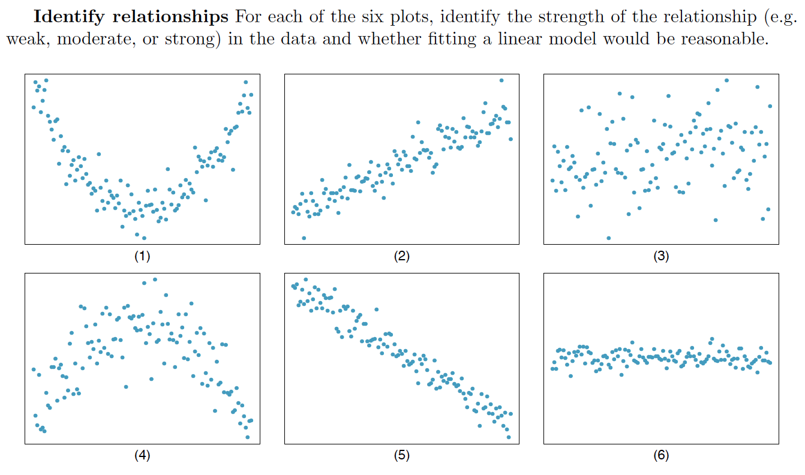

```{r setup, include=FALSE}
library(knitr)
options(digits=3)
knitr::opts_chunk$set(echo = TRUE)
library(dplyr)
library(ggplot2)
library(oilabs)
library(openintro)
```

## 
<center>

</center>


## Estimating $\beta_1$ {.build}

```{r find-b1, echo = FALSE}
poverty <- read.delim("../data/poverty.txt", header = TRUE)
library(ggplot2)
(p1 <- ggplot(poverty, aes(Poverty, Graduates)) + 
  xlim(0, 20) +
  ylim(75, 96) +
  geom_point())
```

We use $s_x, s_y, \textrm{ and } R$ to calculate $b_1$.


## Estimating $\beta_1$ {.build}

```{r find-b1-2, echo = FALSE}
m1 <- lm(Graduates ~ Poverty, data = poverty)
(p2 <- p1 + 
   geom_abline(intercept = 93, slope = m1$coef[2], col = "goldenrod") +
   annotate("text", x = 3, y = 87, label = paste("slope = ", round(m1$coef[2], 2))))
```

We use $s_x, s_y, \textrm{ and } R$ to calculate $b_1$.


## Estimating $\beta_0$ {.build}

```{r find-b02, echo = FALSE}
x_bar <- mean(poverty$Poverty)
y_bar <- mean(poverty$Graduates)
p1 + 
  geom_vline(xintercept = mean(poverty$Poverty), 
                col = "steelblue",
                lty = 2) +
  geom_hline(yintercept = mean(poverty$Graduates), 
                col = "steelblue",
                lty = 2) + 
  geom_abline(intercept = m1$coef[1], slope = m1$coef[2], col = "goldenrod") +
  annotate("text", x = 3, y = 91, label = paste("slope = ", round(m1$coef[2], 2))) +
  annotate("text", x = 14, y = 96, label = paste("x-bar = ", round(x_bar, 2))) +
  annotate("text", x = 19, y = 85, label = paste("y-bar = ", round(y_bar, 2)))
```

If the line of best fit *must* pass through $(\bar{x}, \bar{y})$, what is $b_0$?


## Estimating $\beta_0$ {.build}

Since $(11.35, 86.01)$ is on the line, the following relationship holds.

$$ 86.01 = b_0 - 0.9 (11.35) $$

Then just solve for $b_0$.

$$ b_0 = 86.01 + 0.9 (11.35) = 96.22$$

More generally:

$$ b_0 = \bar{y} - b_1 \bar{x} $$


## Estimation in R {.smaller .build}

```{r fitlm}
m1 <- lm(Graduates ~ Poverty, data = poverty)
summary(m1)
```


## The `lm` object {.build .smaller}

```{r showlm}
attributes(m1)
m1$coef
m1$fit
```


## Interpretation of $b_1$ {.build}

The **slope** describes the estimated difference in the $y$ variable if the explanatory
variable $x$ for a case happened to be one unit larger.

```{r}
m1$coef[2]
```

*For each additional percentage point of people living below the poverty level,
we expect a state to have a proprotion of high school graduates that is 0.898
lower*.

**Be Cautious**: if it is observational data, you do not have evidence of a 
*causal link*, but of an association, which still can be used for prediction.


## Interpretation of $b_0$ {.build}

The **intercept** is the estimated $y$ value that will be taken by a case with 
an $x$ value of zero.

```{r}
m1$coef[1]
```

While necessary for prediction, the intercept often has no meaningful interpretation.

# Visualizing the Residuals

## Residual plot

```{r echo = FALSE, message = FALSE, warning=FALSE}
library(tidyverse)
library(oilabs)
data(mlb11)
```

```{r eval = FALSE}
m1 <- lm(runs ~ at_bats, data = mlb11)
ggplot(m1, aes(x = .fitted, y = .resid)) +
  geom_point() +
  geom_hline(yintercept = 0, linetype = "dashed") +
  xlab("Fitted values") +
  ylab("Residuals")
```

## Residual plot

```{r echo = FALSE}
m1 <- lm(runs ~ at_bats, data = mlb11)
ggplot(m1, aes(x = .fitted, y = .resid)) +
  geom_point() +
  geom_hline(yintercept = 0, linetype = "dashed") +
  xlab("Fitted values") +
  ylab("Residuals")
```

## Distribution of the residuals

```{r eval = FALSE}
ggplot(m1, aes(x = .resid)) +
  geom_histogram(binwidth = 25) +
  xlab("Residuals")

ggplot(m1, aes(sample = .resid)) +
  geom_point(stat = "qq")
```

## Distribution of the residuals

```{r echo = FALSE}
ggplot(m1, aes(x = .resid)) +
  geom_histogram(binwidth = 25) +
  xlab("Residuals")
```

## QQ plot

```{r echo = FALSE}
ggplot(m1, aes(sample = .resid)) +
  geom_point(stat = "qq")
```