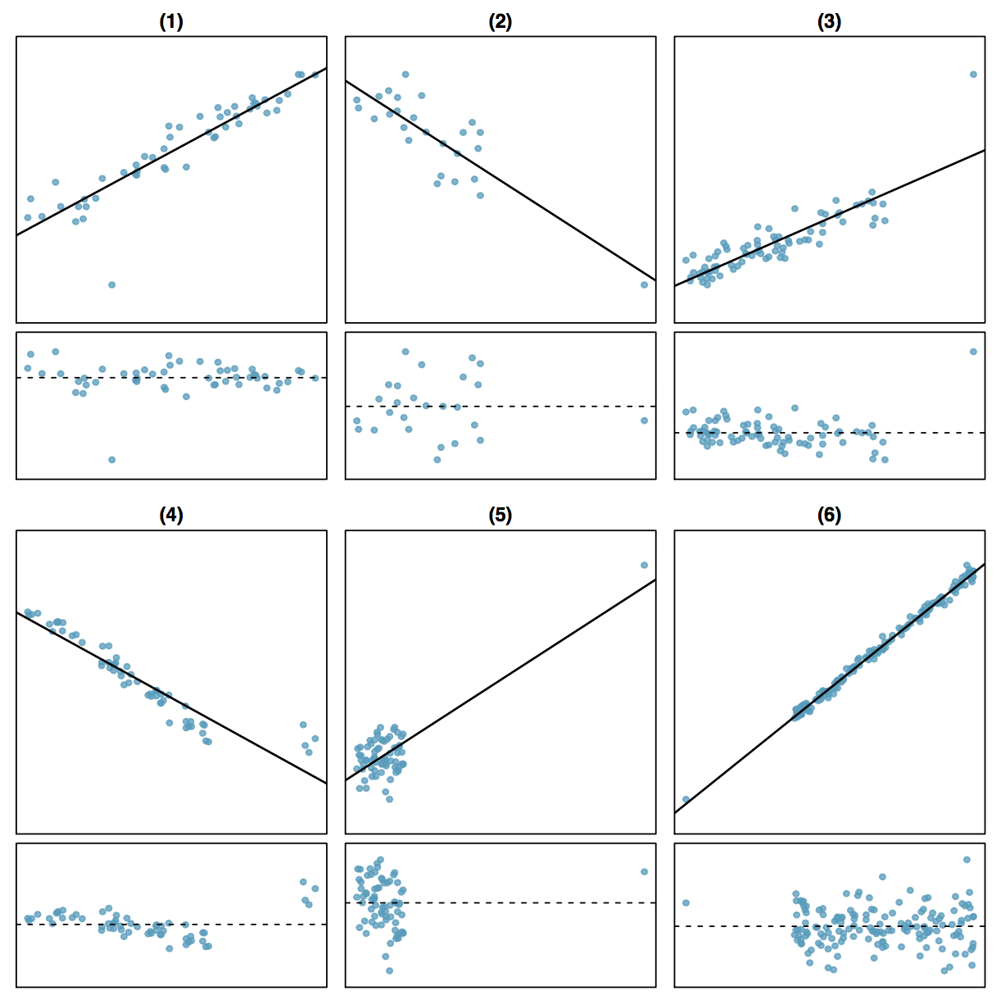

```{r setup, include=FALSE}
library(knitr)
options(digits=3)
knitr::opts_chunk$set(echo = TRUE)
library(dplyr)
library(ggplot2)
library(oilabs)
library(openintro)
```


## What is an outlier? {.build}

<div class="columns-2">


**Outlier** is a general term to describe a data point that doesn't follow the
pattern set by the bulk of the data, when one takes into account the model.
</div>


## Outlier Example One

```{r, echo=FALSE, warning=FALSE, message=FALSE}
# this chunk sets the chunk options for the whole document
require(knitr)
opts_chunk$set(warning=FALSE, message=FALSE)
```

```{r, echo=FALSE}
library(openintro)
COL <- c('#55000088','#225588')
set.seed(238)
n <- c(50, 25, 78, 55, 70, 150)
m <- c(12, -4, 7, -19, 0, 40)
xr <- list(0.3, c(2), 1.42, runif(4,1.45,1.55), 5.78, -0.6)
yr <- list(-4, c(-8), 19, c(-17,-20,-21,-19), 12, -23.2)
i <- 1
x <- runif(n[i])
y <- m[i]*x + rnorm(n[i])
x <- c(x,xr[[i]])
y <- c(y,yr[[i]])
par(mar=c(4,4,1,1), las=1, mgp=c(2.5,0.5,0), cex.lab = 1.25, cex.axis = 1.25, mfrow = c(2,1))
lmPlot(x, y, col = COL[2], lCol = COL[1], lwd = 3)
```


## Outlier Example Two

```{r, echo=FALSE}
i <- 2
x <- runif(n[i])
y <- m[i]*x + rnorm(n[i])
x <- c(x,xr[[i]])
y <- c(y,yr[[i]])
par(mar=c(4,4,1,1), las=1, mgp=c(2.5,0.5,0), cex.lab = 1.25, cex.axis = 1.25, mfrow = c(2,1))
lmPlot(x, y, col = COL[2], lCol = COL[1], lwd = 3)
```


## Outlier Example Three

```{r, echo=FALSE}
i <- 3
x <- runif(n[i])
y <- m[i]*x + rnorm(n[i])
x <- c(x,xr[[i]])
y <- c(y,yr[[i]])
par(mar=c(4,4,1,1), las=1, mgp=c(2.5,0.5,0), cex.lab = 1.25, cex.axis = 1.25, mfrow = c(2,1))
lmPlot(x, y, col = COL[2], lCol = COL[1], lwd = 3)
```


## Outlier Example Four

```{r, echo=FALSE}
i <- 5
x <- runif(n[i])
y <- m[i]*x + rnorm(n[i])
x <- c(x,xr[[i]])
y <- c(y,yr[[i]])
par(mar=c(4,4,1,1), las=1, mgp=c(2.5,0.5,0), cex.lab = 1.25, cex.axis = 1.25, mfrow = c(2,1))
lmPlot(x, y, col = COL[2], lCol = COL[1], lwd = 3)
```


## Outlier Example Four

```{r, echo=FALSE}
par(mar=c(4,4,1,1), las=1, mgp=c(2.5,0.5,0), cex.lab = 1.25, cex.axis = 1.25, mfrow = c(2,1))
lmPlot(x[1:70], y[1:70], col = COL[2], lCol = COL[1], lwd = 3, xlim = range(x), ylim = range(y))
```


## Outliers, leverage, influence {.build}

**Outliers** are points that don't fit the trend in the rest of the data.

**High leverage points** have the potential to have an unusually large influence 
on the fitted model.

**Influential points** are high leverage points that cause a very different
line to be fit than would be with that point removed.


## Example of high lev, high influence

We have data on the surface temperature and light intensity of 47 stars in the
star cluster CYG OB1, near Cygnus.

```{r, echo=FALSE}
library(faraway)
data(star)
par(mar=c(4,4,2,1), las=1, mgp=c(2.5,0.7,0), cex.lab = 1.25, cex.axis = 1.25)
plot(light ~ temp, data = star, pch=19, col=COL[2], xlab = "log(temp)", ylab = "log(light intensity)")
```


## Example of high lev, high influence

We have data on the surface temperature and light intensity of 47 stars in the
star cluster CYG OB1, near Cygnus.

```{r, echo=FALSE}
par(mar=c(4,4,2,1), las=1, mgp=c(2.5,0.7,0), cex.lab = 1.25, cex.axis = 1.25)
plot(light ~ temp, data = star, pch=19, col=COL[2], xlab = "log(temp)", ylab = "log(light intensity)")
abline(lm(light~temp, data = star), col = "darkgreen", lwd = 3, lty = 2)
legend("top", inset = 0.05, "w/ outliers", lty = 2, lwd = 2, col = "darkgreen")
```


## Example of high lev, high influence

We have data on the surface temperature and light intensity of 47 stars in the
star cluster CYG OB1, near Cygnus.

```{r, echo=FALSE}
par(mar=c(4,4,2,1), las=1, mgp=c(2.5,0.7,0), cex.lab = 1.25, cex.axis = 1.25)
plot(light ~ temp, data = star, pch=19, col=COL[2], xlab = "log(temp)", ylab = "log(light intensity)")
abline(lm(light~temp, data = star), col = "darkgreen", lwd = 3, lty = 2)
abline(lm(light[temp>4]~temp[temp>4], data = star), col = COL[1], lwd = 3)
legend("top", inset = 0.05, c("w/ outliers","w/o outliers"), lty = c(2,1), lwd = c(2,3), col = c("darkgreen",COL[1]))
```


## Example of high lev, low influence

```{r, echo=FALSE}
set.seed(12)
i <- 2
x <- runif(n[i])
y <- m[i]*x + rnorm(n[i])
x <- c(x,xr[[i]])
y <- c(y,yr[[i]])
y <- y - mean(y)
par(mar=c(4,4,1,1), las=1, mgp=c(2.5,0.5,0), cex.lab = 1.25, cex.axis = 1.25, mfrow = c(2,1))
lmPlot(x, y, col = COL[2], lCol = COL[1], lwd = 3)
```


## From leverage to influence

**Leverage** measures the weight given to each point in determining the regression
line.

**Influence** measures how different the regression line would be without a given
point. Often measured with *Cook's Distance*.

```{r, echo=FALSE, fig.height=4, }
i <- 5
x <- runif(n[i])
y <- m[i]*x + rnorm(n[i])
x <- c(x,xr[[i]])
y <- c(y,yr[[i]])
par(mfrow = c(1, 2))
plot(x, y, col = COL[2], pch = 16)
abline(lm(y ~ x), col = COL[1], lwd = 3)
x2 <- x[1:70]
y2 <- y[1:70]
plot(x2, y2, col = COL[2], pch = 16, xlim = range(x), ylim = range(y))
abline(lm(y2 ~ x2), col = COL[1], lwd = 3)
```


##

In the following plots are there outliers, leverage pts, or influential pts?

<center>

</center>
