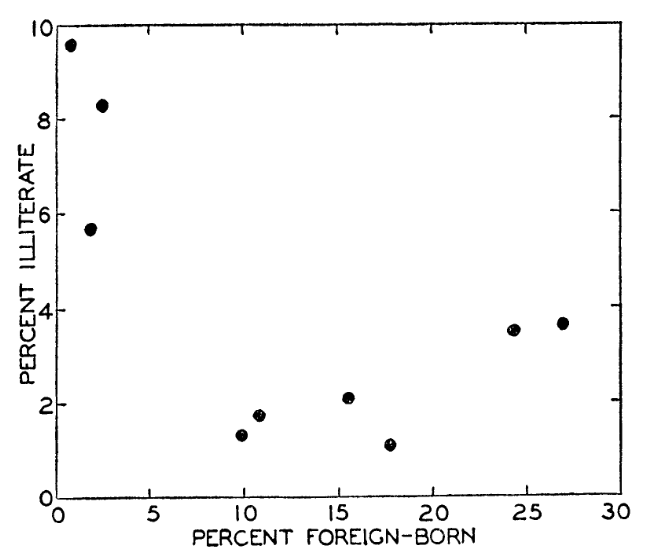
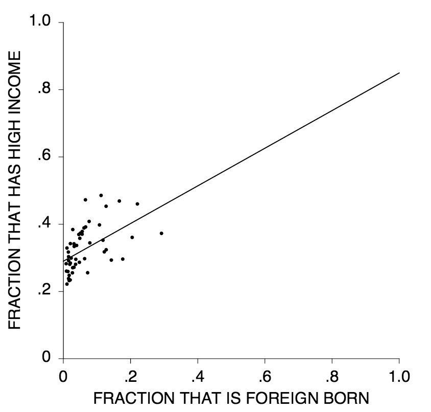

```{r setup, include=FALSE}
library(knitr)
options(digits=3)
knitr::opts_chunk$set(echo = TRUE, fig.align = "center")
library(dplyr)
library(ggplot2)
library(oilabs)
library(openintro)
```


## Immigration and Illiteracy {.flexbox .vcenter .build}

Robinson (1950)



**Suggests foreign-born people tend to be more literate (cor = -0.51).**


## Immigration and Illiteracy

```{r echo = FALSE, fig.height = 3.5, fig.width = 5}
birthplace <- rep(c("foreign", "native"), each = 100)
literate <- as.factor(c(rep(c("yes", "no"), c(90, 10)), rep(c("yes", "no"), c(96, 4))))
literate <-  factor(literate, levels(literate)[c(2,1)])
df <- data.frame(birthplace, literate)
ggplot(df, aes(x = birthplace, fill = literate)) +
  geom_bar(position = "fill")
```

- correlation = 0.11


## What's going on? {.flexbox .vcenter .build}
  

- **Unit of observation**: region (New England, Mountain, Pacific, etc.)
- **Explanation**: regions with many foreign-born have highly literate natives.


## Ecological Fallacy

The false assumption that relationships that exist at an **aggregated level** (e.g.
between states, counties, nations) also hold at the **individual level**.


## Immigration and Income {.flexbox .vcenter .build}

Freedman (1999)



**Suggests that foreign-born populations tend to have higher incomes (corr = 0.52).**


## Immigration and Income

```{r echo = FALSE, fig.height = 3.5, fig.width = 5}
birthplace <- rep(c("foreign", "native"), each = 100)
highincome <- as.factor(c(rep(c("yes", "no"), c(28, 72)), rep(c("yes", "no"), c(35, 65))))
highincome <-  factor(highincome, levels(highincome)[c(2,1)])
df <- data.frame(birthplace, highincome)
ggplot(df, aes(x = birthplace, fill = highincome)) +
  geom_bar(position = "fill")
```

- correlation = -0.05


## What's going on? {.flexbox .vcenter .build}


- **Unit of observation**: state
- **Explanation**: states with many foreign-born people have natives with
higher incomes.


#

## Ecological Fallacy {.build}

The false assumption that relationships that exist at an **aggregated level** (e.g.
between states, counties, nations) also hold at the **individual level**.

Interpretations can invert due to:

- confounding / omitted variable (Model 1)
- aggregation (Model 2)


## Strategies {.build}

1. When dealing with an ecological study, restrict model interpretations to the 
same observational level on which the data was collected.

2. If you want to make individual-level inferences, be sure your data is collected
on that same level. Aggregate-level effects can be introduced via a multi-level model.


